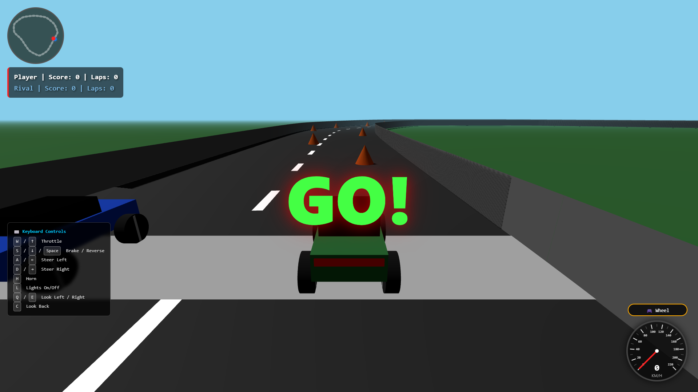
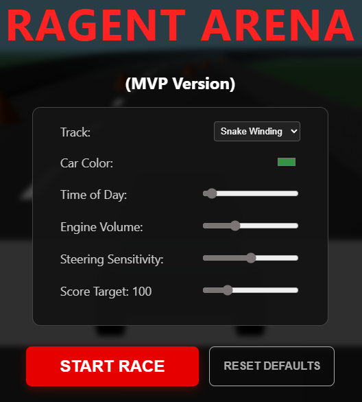
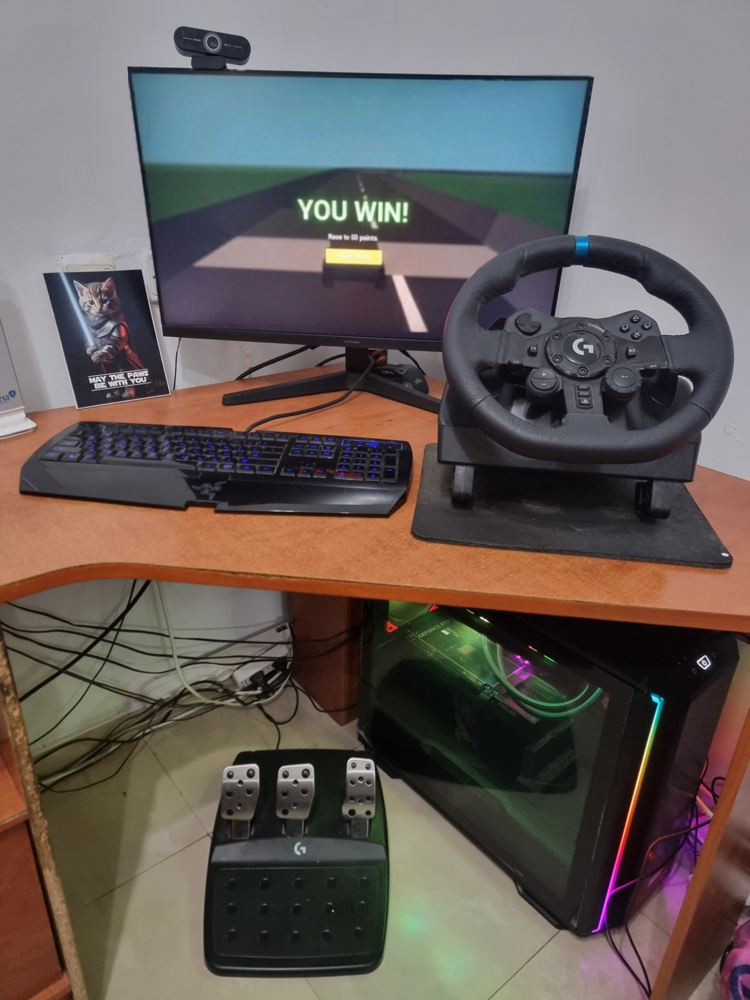

<p align="center">
  
</p>

# 🏎️ Ragent Arena - Tech Prototype (MVP)

[](https://www.typescriptlang.org/)
[](https://threejs.org/)
[](https://vite.dev/)
[](https://developer.mozilla.org/en-US/docs/Web/API/Web_Audio_API)

A lightweight, browser-based 3D racing simulator built from scratch using **Vanilla TypeScript** and **Three.js**. 

This project serves as the foundational MVP and technical proof-of-concept for the upcoming **Ragent Arena** multiplayer game. It demonstrates raw WebGL rendering, custom kinematics, procedural audio, and direct hardware integration without relying on heavy game engines like Unity or Unreal.

🎮 **[Play the Live Demo Here] (Link will be added after deployment)**

---

## 🧭 Table of Contents

- [Key Features](#-key-features)
- [Controls](#%EF%B8%8F-controls)
- [Tech Stack & Architecture](#%EF%B8%8F-tech-stack--architecture)
- [Local Development](#-local-development)
- [Pictures](#-pictures)

---

## ✨ Key Features

- **Hardware Integration:** Native support for the **Logitech G923** Racing Wheel & Pedals via the Gamepad API, featuring precise analog inputs. Fallback keyboard controls included.
- **Dynamic Track Generation:** Tracks are generated mathematically using `CatmullRomCurve3` splines. Walls and roads are built seamlessly using continuous `BufferGeometry`.
- **Procedural Audio Engine:** All sounds (including the engine, crash impacts, tire skids, etc.) are synthesized in real-time using the `Web Audio API` (Oscillators and White Noise buffers) based on the vehicle's telemetry.
- **NPC AI Controller:** Features a smart rival AI with dynamic lookahead routing, corner-braking logic, and a reverse anti-stuck mechanism.
- **Anti-Cheat Checkpoint System:** A quadrant-based and curve-based mathematical tracking system to prevent lap-skipping.
- **Polished UX:** Glassmorphism UI, real-time minimap, dynamic day/night lighting cycles, interactive speedometers, and particle systems (smoke and skid marks).

<p align="right">(<a href="#-table-of-contents">back to top</a>)</p>

---

## 🕹️ Controls

### Keyboard
- **W / Up Arrow:** Throttle
- **S / Down Arrow / Space:** Brake / Reverse
- **A / D / Left / Right:** Steer
- **Q / E:** Look Left / Right
- **C:** Look Back
- **H:** Horn
- **L:** Toggle Headlights

### Racing Wheel (Logitech G923)
- **Gas Pedal:** Throttle
- **Brake Pedal:** Brake / Reverse
- **Steering Wheel:** Steer
- **Paddle Left / Right:** Look Left / Right
- **Square:** Look Back
- **Triangle:** Toggle Headlights
- **X:** Horn

<p align="right">(<a href="#-table-of-contents">back to top</a>)</p>

---

## 🛠️ Tech Stack & Architecture

- **Core:** Vanilla TypeScript
- **Graphics:** Three.js (WebGL)
- **Build Tool:** Vite
- **Architecture highlights:**
  - Zero dependencies on external 3D models (pure code-generated geometry).
  - Memory-efficient object pooling for particle systems.
  - Custom Kinematic Physics tailored for top-down/chase-cam arcade racing.

<p align="right">(<a href="#-table-of-contents">back to top</a>)</p>

---

## 🚀 Local Development

Want to run the simulator locally on your machine?

1. Clone the repository:
   ```bash
   git clone [https://github.com/Or-Hason/ragent-mvp.git](https://github.com/Or-Hason/ragent-mvp.git)

2. Navigate to the project directory:
   ```bash
   cd ragent-mvp

3. Install dependencies:
   ```bash
   npm install

4. Run the Vite development server:
   ```bash
   npm run dev

5. Open the application in your browser at http://localhost:5173 .

<p align="right">(<a href="#-table-of-contents">back to top</a>)</p>

---

## 📸 Pictures

<p align="center">
  
</p>

<p align="center">
  
</p>

<p align="right">(<a href="#-table-of-contents">back to top</a>)</p>

---

Note: This repository is a static archive of the MVP phase. The full multiplayer version (V2) is currently in development in a separate Monorepo, and it's based on entirely new engine.
